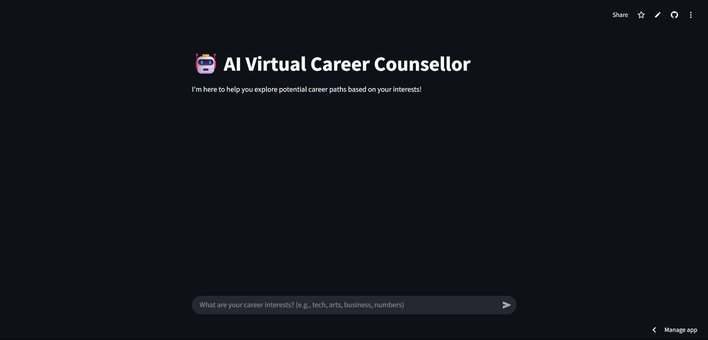

# 🤖 AI Virtual Career Counsellor

An intelligent virtual assistant designed to help users explore potential career paths based on their interests and skills. Built with **Rasa** for conversational AI and **Streamlit** for an interactive web interface, this counsellor provides instant, personalized career guidance.

---

## ✨ Features

- **Interactive Chat Interface:** A user-friendly and responsive chat application powered by Streamlit.
- **Natural Language Understanding (NLU):** Leverages Rasa's NLU capabilities to understand user queries about their career interests.
- **Dynamic Career Recommendations:** Provides tailored suggestions for various fields, including:
  - **Technology:** Software Developer, Data Scientist, Cybersecurity Analyst, Web Developer.
  - **Arts & Design:** Graphic Designer, Animator, Content Creator, Fine Artist.
  - **Commerce & Business:** Financial Analyst, Accountant, Marketing Manager, Business Consultant.
  - **Psychology:** Psychologist, Counselor, Social Worker, HR Specialist.
  - **Healthcare:** Doctor, Nurse, Medical Researcher, Public Health Professional.
- **Action Server Integration:** Custom actions in Rasa allow for structured responses and more complex logic beyond simple text replies.

---

## 🚀 How to Run

This project is set up for easy deployment and development using **GitHub Codespaces**, providing a consistent and ready-to-go environment.

### 1. Open in Codespaces

- Click the "Code" button on this GitHub repository page.
- Navigate to the **"Codespaces"** tab.
- Select **"Create codespace on main."**

> The Codespaces environment is pre-configured to install dependencies and set up the Rasa project via `.devcontainer/postCreateCommand`.

### 2. Start Services in Separate Terminals

Once Codespaces is initialized, run the following in **three separate terminal windows**:

#### Terminal 1: Rasa Action Server
```bash
rasa run actions
```

#### Terminal 2: Rasa Core & NLU Server
```bash
rasa run --enable-api --cors "*" --endpoints endpoints.yml
```

#### Terminal 3: Streamlit Frontend
```bash
streamlit run app.py
```

### 3. Access the Application

- A new tab should open automatically with the Streamlit interface.
- If not, check the **Ports** tab in Codespaces (usually port `8501`).

---

## 🌐 Optional: Accessing Rasa from Outside Codespaces (via ngrok)

If you need to expose your Rasa server (port 5005) publicly:

1. **Install & authenticate ngrok:**
   - Sign up at [ngrok.com](https://dashboard.ngrok.com/signup)
   - Get your authtoken and run:
     ```bash
     ngrok config add-authtoken YOUR_ACTUAL_AUTHTOKEN_HERE
     ```

2. **Start ngrok tunnel:**
   ```bash
   ngrok http 5005
   ```

- You'll receive a public HTTPS URL (e.g., `https://xxxx-xx-xxx-xxx-xxx.ngrok-free.app`)
- Update `RASA_API_URL` in `app.py` with this URL if deploying the Streamlit app externally.

---

## 💡 How to Interact

Start chatting with the bot! Example inputs:

- "Hi there!"
- "I'm interested in programming and software development."
- "What kind of careers are there in art and design?"
- "I'm really good with numbers and business concepts."
- "Tell me about psychology as a career."
- "What about healthcare jobs?"
- "Can you recommend something for me?"
- "Thank you!"
- "Bye"

---

## 🔮 Future Enhancements

- **Expanded Career Database**
- **Deeper Recommendation Logic**
- **External API Integration** (e.g., LinkedIn, Coursera)
- **User Profiles**
- **Multilingual Support**
- **Interview Prep & Skill Development Guidance**

---

## 📸 Screenshot



---

## 🙏 Acknowledgements

This project was built using powerful open-source tools:

- [**Rasa**](https://rasa.com/)
- [**Streamlit**](https://streamlit.io/)
- [**GitHub Codespaces**](https://github.com/features/codespaces)
- [**ngrok**](https://ngrok.com/)
